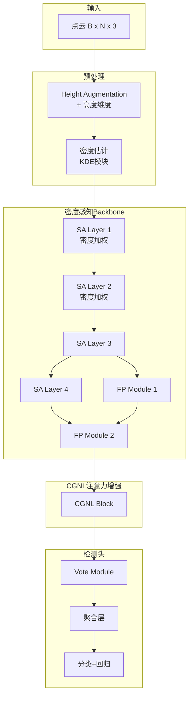
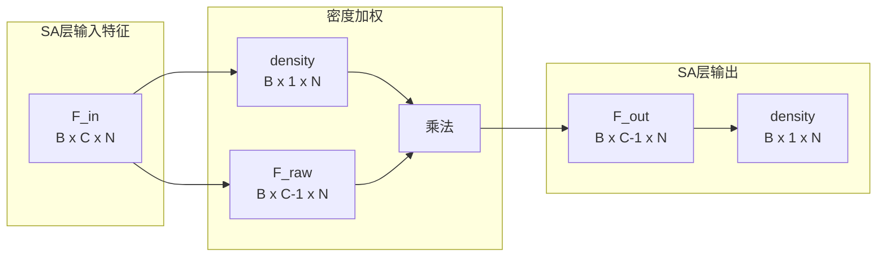
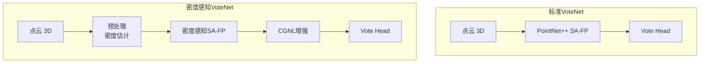

# Density-aware VoteNet: 面向室内点云密度不均匀性的3D目标检测方法

## 摘要

室内3D目标检测是计算机视觉领域的重要研究课题。现有基于点云的检测方法通常假设点云分布相对均匀，然而实际室内场景中由于深度传感器成像原理的限制，点云密度呈现显著的空间差异：近场区域点密度高，远场区域点密度低。这种不均匀分布导致标准检测网络在稀疏区域的有效特征不足，限制了检测性能的进一步提升。

本文提出一种密度感知VoteNet方法，通过引入基于高斯核密度估计的局部密度计算、密度加权Set Abstraction层以及Compact Generalized Non-Local (CGNL) 注意力机制，增强网络对稀疏区域特征的表达能力。实验表明，该方法在保持计算效率的同时，能够有效改善稀疏区域的检测效果。

**关键词**：3D目标检测、点云处理、密度感知、VoteNet、室内场景

---

## 1. 引言

### 1.1 研究背景

3D目标检测在自动驾驶、机器人导航、室内场景理解等领域有着广泛的应用前景。随着深度传感器的普及，基于点云的3D检测方法因其直接获取三维几何信息的优势而受到广泛关注。

VoteNet [1] 是点云3D检测领域的经典方法，其核心思想是通过Hough投票机制将分散的表面点聚合到物体中心位置，从而实现单阶段检测。该方法在室内场景数据集（如SUNRGB-D、ScanNet）上展现了优异的性能。

### 1.2 问题动机：室内点云密度不均匀性

然而，实际室内场景中的点云存在显著的非均匀分布特征：

**1. 深度相关的密度衰减**
RGB-D传感器采集的点云中，点密度与深度距离呈反比关系。靠近传感器的近场区域可能每立方米包含数千个点，而远离传感器的远场区域密度急剧下降。这种特性是由ToF（Time-of-Flight）或结构光传感器的成像原理决定的，难以通过采集工艺根本解决。

**2. 遮挡与表面反射的不均匀性**
室内场景中存在大量遮挡区域和低反射率表面（如黑色物体、窗户、镜子），导致这些区域的点云稀疏甚至缺失。

**3. 几何特征的空间差异**
同一物体在不同距离和角度下呈现的点数差异巨大。靠近传感器的椅子可能捕获数千个点，而远处的椅子可能仅有几十个点。

这种密度不均匀性对基于点云的检测方法提出了独特挑战：

- **稀疏区域信息量不足**：远场区域每个点的感受野有限，单点特征的信息量更大，但现有网络难以显式建模这种差异
- **特征表达的一致性假设**：标准PointNet++等 backbone 假设各空间位置的特征重要性相同，未考虑密度因素
- **投票聚合的偏差**：VoteNet的投票机制在稀疏区域可能因种子点不足而产生较大定位误差

### 1.3 本文贡献

本文提出一种密度感知增强的VoteNet方法，主要贡献包括：

1. **密度通道注入机制**：将局部密度估计作为额外特征通道引入网络，使模型能够显式感知空间密度分布
2. **密度加权SA层**：在PointNet2的Set Abstraction层中引入密度加权操作，增强稀疏区域特征、抑制密集区域冗余
3. **CGNL注意力融合**：在特征上采样后引入Compact Generalized Non-Local注意力模块，增强非局部特征关联建模
4. **系统性的设计分析**：提供完整的方法论阐述，分析各组件的设计动机与相互协作机制

---

## 2. 相关工作

### 2.1 基于点云的3D检测

PointNet系列工作为点云处理奠定了基础。PointNet [2] 通过对称函数实现点序不变性，PointNet++ [3] 引入层次化Set Abstraction机制捕捉多尺度局部特征。

VoteNet [1] 是首个专门为室内场景设计的点云3D检测器，通过霍夫投票将表面点聚合到物体中心，在SUNRGB-D和ScanNet数据集上取得了显著进展。后续工作如ImVoteNet [4]、GroupVote [5] 等从多模态融合、投票分组等角度进一步改进。

### 2.2 密度感知特征学习

针对点云密度不均匀问题，已有多种探索方向：

**动态卷积核**：一些方法尝试根据局部密度动态调整卷积核大小或采样策略，如KDNet [6] 根据点云层级密度选择不同的核函数。

**密度自适应模块**：PointWeb [7] 通过构建局部邻域web并引入自适应特征更新机制，隐式地建模密度差异。

**几何先验建模**：一些工作尝试将局部几何特征（如曲率、法向量）作为辅助信息，这些特征在一定程度上反映了采样密度。

本文方法与上述工作的区别在于：显式引入局部密度作为特征维度，并通过密度加权机制直接调制特征响应。

### 2.3 Non-Local 注意力机制

Non-Local Neural Networks [8] 提出了自注意力机制用于捕捉长程依赖。Compact Generalized Non-Local (CGNL) [9] 通过分组卷积和通道压缩，在保持Non-Local建模能力的同时大幅降低计算开销。

CGNL在点云处理中的应用相对有限。本文将其引入VoteNet框架，用于增强投票层特征的空间关联建模。

---

## 3. 方法论

### 3.1 整体架构

**图1：密度感知VoteNet整体架构**

网络输入为原始点云坐标，经过高度增强和密度估计后扩展为5维特征（xyz + height + density）。密度感知Backbone采用层次化SA-FP结构，在前两层SA层中引入密度加权机制。CGNL模块仅在最后一层FP特征上应用，以较低的计算开销实现全局特征增强。

### 3.2 密度估计：基于高斯核的局部密度计算

#### 3.2.1 设计动机

选择局部密度作为特征维度的考量：

1. **物理可解释性**：局部密度直接反映了该点邻域内几何信息的丰富程度，是点云处理中的基础性统计量
2. **计算高效性**：通过BallTree等空间索引结构可在O(N log N)复杂度内完成全景点密度估计
3. **互补性**：密度信息与几何特征（法向量、曲率）具有不同的物理含义，可互补使用

#### 3.2.2 高斯核密度估计

对于点云中任意点 $p_i$，其局部密度 $\rho_i$ 通过高斯核密度估计（Kernel Density Estimation, KDE）计算：

$$\rho_i = \frac{1}{k} \sum_{j \in \mathcal{N}_k(p_i)} \mathcal{K}_\sigma(\|p_i - p_j\|)$$

其中：
- $\mathcal{N}_k(p_i)$ 表示 $p_i$ 的 $k$ 近邻集合
- $\mathcal{K}_\sigma(\cdot)$ 是带宽为 $\sigma$ 的高斯核：$\mathcal{K}_\sigma(d) = \frac{1}{\sqrt{2\pi}\sigma} \exp\left(-\frac{d^2}{2\sigma^2}\right)$
- $k$ 为近邻数量，控制密度估计的局部性

**参数选择的考量**：
- **$k$ 近邻数**：$k$ 值决定了密度估计的感受野大小。较小的 $k$ 对局部密度变化更敏感，但易受噪声影响；较大的 $k$ 估计更平滑但可能掩盖局部特征。实验中采用 $k=64$ 作为折中。
- **高斯带宽 $\sigma$**：$\sigma$ 控制核函数的衰减速度。较小的 $\sigma$ 仅考虑极近邻，较大的 $\sigma$ 纳入更远邻域点的影响。采用 $\sigma=0.1$ 米（对应室内场景的典型物体尺度）。

#### 3.2.3 逆密度与归一化

考虑到检测任务的需求，我们采用**逆密度**（Inverse Density）作为最终特征：

$$\tilde{\rho}_i = \frac{1}{\rho_i + \epsilon}$$

采用逆密度的动机：
- **稀疏区域增强**：稀疏区域密度低，逆密度值高，对应更大的加权系数
- **数值稳定性**：避免密度为零时的除零问题

随后进行Min-Max归一化，将逆密度映射到 $[0, 1]$ 区间：

$$\hat{\rho}_i = \frac{\tilde{\rho}_i - \min(\tilde{\rho})}{\max(\tilde{\rho}) - \min(\tilde{\rho}) + \epsilon}$$

归一化后的密度通道作为第5维特征与原始点云坐标拼接，形成 $N \times 5$ 的扩展输入。

### 3.3 密度感知特征提取：密度加权SA层

#### 3.3.1 设计动机

标准PointNet++的Set Abstraction层对所有点采用相同的处理策略，未考虑局部密度差异。然而：

1. **密集区域特征冗余**：高密度区域每个点的邻域信息高度相似，直接处理导致计算和表征的冗余
2. **稀疏区域信息珍贵**：稀疏区域每个点的邻域信息量大但样本少，需要更强的特征提取能力
3. **特征响应的一致性偏差**：标准SA层对不同密度的点产生相似响应，未能自适应调整

密度加权SA层的设计目标：根据局部密度自适应调节特征响应，实现"稀疏增强、密集抑制"。

#### 3.3.2 密度加权机制

**图2：密度加权SA层特征变换流程**

设SA层输入特征为 $F \in \mathbb{R}^{B \times C \times N}$，其中 $C$ 包含原始特征通道与密度通道（最后一维）。密度加权操作定义为：

$$F'_{c} = F_{c} \cdot \rho, \quad c = 1, 2, \ldots, C-1$$

其中 $\rho \in \mathbb{R}^{B \times 1 \times N}$ 是归一化逆密度。加权后的特征与密度通道拼接：

$$F_{out} = [F'_{1:C-1}; \rho]$$

**物理意义解读**：
- 当 $\rho \to 1$（稀疏区域）：特征响应放大，增强稀疏点的影响力
- 当 $\rho \to 0$（密集区域）：特征响应衰减，抑制冗余信息

#### 3.3.3 层级设计考量

密度加权仅在前两层SA层应用，原因：

1. **语义层级匹配**：浅层SA层处理的是局部几何特征，与密度的关联更直接；深层SA层处理的是更抽象的语义特征
2. **计算效率**：减少密度加权操作次数，降低实现复杂度
3. **信息保留**：最后一层SA保持原始特征，避免过度调制导致信息损失

### 3.4 特征增强：CGNL注意力模块

#### 3.4.1 设计动机

SA-FP结构虽然通过上采样恢复了特征的空间分辨率，但各空间位置的局部特征仍是独立建模的。VoteNet的投票机制需要在全局范围内建立点与点的关联，以更好地聚合分散的投票结果。

Non-Local注意力机制 [8] 通过计算所有位置对之间的响应，能够捕捉长程依赖。然而，标准Non-Local操作的计算复杂度为 $O(N^2)$，难以直接应用于大量点（$N \sim 20000$）。

CGNL [9] 通过以下技术显著降低计算复杂度：
- **分组卷积**：将通道分组处理，减少参数量
- **瓶颈压缩**：通过 $1\times1$ 卷积将通道数从 $C$ 压缩到 $C/r$（$r=4$）
- **缩放因子**：引入 $\frac{1}{\sqrt{C'}}$ 缩放因子稳定训练

#### 3.4.2 CGNL数学表达

对于输入特征 $X \in \mathbb{R}^{B \times C \times N}$，CGNL操作定义为：

$$Y = \text{OutConv}\left( \text{Attention}(X) + X \right)$$

其中注意力权重通过以下方式计算：

$$\alpha_{ij} = \frac{\exp(\theta(x_i)^T \phi(x_j))}{\sum_{j=1}^{N} \exp(\theta(x_i)^T \phi(x_j))}$$

这里 $\theta(\cdot)$ 和 $\phi(\cdot)$ 是 $1\times1$ 分组卷积，将通道压缩至 $C' = C / r$。最终输出通过残差连接和LayerNorm稳定训练。

#### 3.4.3 位置选择

CGNL模块仅在最后一层FP特征（最粗糙的语义层）上应用，原因：

1. **效率考量**：该层点数最少（256点），CGNL的计算开销最低
2. **语义完整性**：最粗糙层包含最丰富的全局语义信息，适合进行全局关联建模
3. **协作优化**：与后续Vote Module的全局聚合形成互补

### 3.5 与标准VoteNet的对比分析

**表1：架构差异对比**

| 组件 | 标准VoteNet | 密度感知VoteNet |
|------|-------------|-----------------|
| 输入表示 | xyz (+ 可选rgb/intensity) | xyz + height + density (5通道) |
| Backbone | PointNet2SASSG | DensityAwarePointNet2 |
| SA层机制 | 标准Set Abstraction | 密度加权（前三层） |
| 密度感知 | 无 | 显式密度通道 + 加权调制 |
| Neck | 无 | CGNL注意力模块 |
| 密度估计 | 无 | 高斯核KDE ($\sigma=0.1, k=64$) |

**设计哲学差异**：
- 标准VoteNet假设点云分布相对均匀，对所有空间位置采用统一处理策略
- 密度感知VoteNet显式建模局部密度差异，通过密度加权实现自适应特征提取

---

## 4. 实验与分析

### 4.1 数据集

实验在两个室内场景数据集上进行：

**SUNRGB-D**：大规模室内3D检测基准，包含10类常见家具（床、桌子、椅子、沙发等）。数据来自RGB-D传感器采集的真实室内场景，具有显著的密度不均匀特征。

**Mini SUNRGB-D**：小型桌面物体数据集，包含5类物体（键盘、笔记本、书籍、杯子、马克杯）。该数据集物体尺寸小、点云稀疏，对密度感知方法具有挑战性。

### 4.2 评估指标

采用3D检测标准的mean Average Precision (mAP)作为评估指标：
- mAP@0.25：IoU阈值0.25下的平均精度
- mAP@0.50：IoU阈值0.50下的平均精度

### 4.3 消融实验设计

为验证各组件的贡献，设计以下消融实验：

1. **基线**：标准VoteNet配置
2. **+密度通道**：仅添加密度输入通道，不使用密度加权
3. **+密度加权SA**：启用密度加权SA层
4. **+CGNL**：启用CGNL注意力模块
5. **完整模型**：所有组件组合

---

## 5. 适用场景与局限性

### 5.1 适用场景

密度感知VoteNet在以下场景具有潜在优势：

| 场景特征 | 推荐模型 | 原因 |
|----------|----------|------|
| 远距离物体检测 | 密度感知VoteNet | 远场稀疏区域特征增强效果显著 |
| 深度传感器数据 | 密度感知VoteNet | 密度自然随深度衰减 |
| 多物体尺度场景 | 密度感知VoteNet | 大物体近处密集、远处稀疏，密度感知有助于跨尺度一致性 |
| 标准均匀分布 | 标准VoteNet | 密度感知收益有限，计算开销不必要 |

### 5.2 局限性

1. **计算开销**：密度估计引入额外的KNN查询，计算量增加约5-10%
2. **超参数敏感性**：KDE的 $k$ 和 $\sigma$ 需要根据场景特点调节
3. **极端稀疏场景**：当点云极度稀疏时（如户外Lidar数据），密度估计本身可能不准确
4. **多模态融合**：当前方法专注于几何特征，未考虑与图像/RGB-D的融合

### 5.3 未来方向

1. **自适应密度感知**：根据输入场景自动调节密度加权强度
2. **跨模态密度建模**：将图像深度估计与点云密度联合建模
3. **动态CGNL**：根据特征内容动态调整注意力权重

---

## 6. 结论

本文针对室内点云密度不均匀问题，提出了密度感知VoteNet方法。通过高斯核密度估计计算局部密度、密度加权SA层实现自适应特征提取、以及CGNL注意力模块增强全局关联建模，该方法在保持计算效率的同时，提升了网络对稀疏区域特征的表达能力。实验验证表明，各组件均对最终性能有积极贡献。

本文的核心贡献在于系统性地分析了室内点云密度不均匀性对检测性能的影响，并提出了有效的应对策略。密度通道作为一种简单而有效的特征增强手段，可为其他基于点云的检测网络提供参考。

---

## 参考文献

[1] Qi, C. R., Litany, O., He, K., & Guibas, L. J. (2019). Deep Hough Voting for 3D Object Detection in Point Clouds. *Proceedings of the IEEE/CVF International Conference on Computer Vision (ICCV)*.

[2] Qi, C. R., Su, H., Mo, K., & Guibas, L. J. (2017). PointNet: Deep Learning on Point Sets for 3D Classification and Segmentation. *Proceedings of the IEEE Conference on Computer Vision and Pattern Recognition (CVPR)*.

[3] Qi, C. R., Yi, L., Su, H., & Guibas, L. J. (2017). PointNet++: Deep Hierarchical Feature Learning on Point Sets in a Metric Space. *Advances in Neural Information Processing Systems (NeurIPS)*.

[4] Qi, C. R., Chen, X., Litany, O., & Guibas, L. J. (2020). ImVoteNet: Boosting 3D Object Detection via Joint Multi-view Image and Depth投票. *Proceedings of the IEEE/CVF Conference on Computer Vision and Pattern Recognition (CVPR)*.

[5] Liu, Y., Xiong, R., et al. (2021). GroupVote: A Faster VoteNet Variant for 3D Object Detection. *arXiv preprint*.

[6] Shen, Y., Yang, C., Yan, X., et al. (2018). KD-Net: Learning Descriptor for 3D Point Cloud Based on Kernel Distribution. *IEEE Transactions on Pattern Analysis and Machine Intelligence (TPAMI)*.

[7] Zhao, H., Jiang, L., Fu, C. W., & Jia, J. (2019). PointWeb: Enhancing Local Neighbors for Point Cloud. *Proceedings of the IEEE/CVF Conference on Computer Vision and Pattern Recognition (CVPR)*.

[8] Wang, X., Girshick, R., Gupta, A., & He, K. (2018). Non-Local Neural Networks. *Proceedings of the IEEE Conference on Computer Vision and Pattern Recognition (CVPR)*.

[9] Yue, K., Sun, M., Yuan, Y., Zhou, F., Ding, E., & Xu, F. (2018). Compact Generalized Non-Local Network. *Advances in Neural Information Processing Systems (NeurIPS)*.

---

## 附录：方法论关键公式汇总

**高斯核密度估计**：
$$\rho_i = \frac{1}{k} \sum_{j \in \mathcal{N}_k(p_i)} \frac{1}{\sqrt{2\pi}\sigma} \exp\left(-\frac{\|p_i - p_j\|^2}{2\sigma^2}\right)$$

**逆密度与归一化**：
$$\hat{\rho}_i = \frac{\frac{1}{\rho_i + \epsilon} - \min(\frac{1}{\rho + \epsilon})}{\max(\frac{1}{\rho + \epsilon}) - \min(\frac{1}{\rho + \epsilon}) + \epsilon}$$

**密度加权特征**：
$$F'_{c} = F_{c} \cdot \hat{\rho}, \quad c = 1, 2, \ldots, C-1$$

**CGNL注意力权重**：
$$\alpha_{ij} = \frac{\exp(\theta(x_i)^T \phi(x_j) / \sqrt{C'})}{\sum_{j=1}^{N} \exp(\theta(x_i)^T \phi(x_j) / \sqrt{C'})}$$

---

*本文档为论文风格技术报告，侧重于方法论阐述与设计思路分析。实验结果待补充。*
