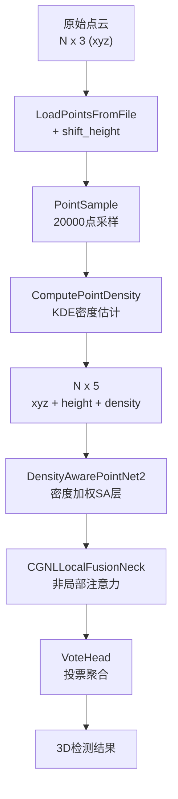
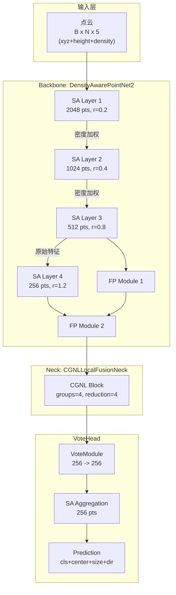
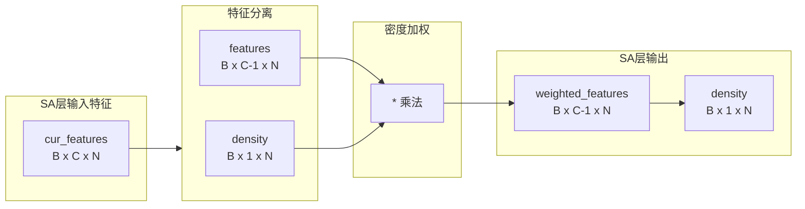
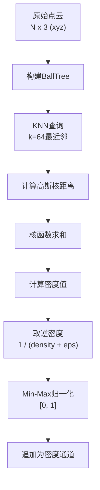
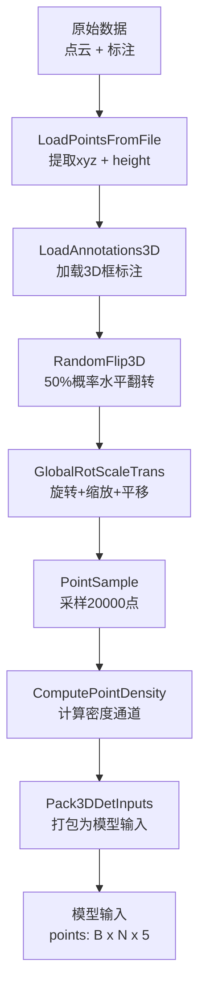
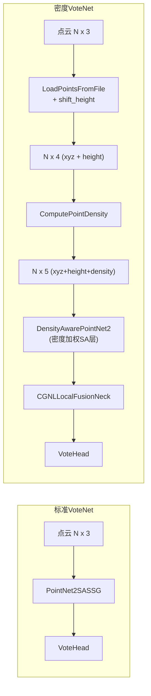

# 密度感知VoteNet技术报告

## 目录

1. [项目背景](#1-项目背景)
2. [模型架构](#2-模型架构)
3. [密度特征设计](#3-密度特征设计)
4. [数据集](#4-数据集)
5. [数据预处理](#5-数据预处理)
6. [训练配置](#6-训练配置)
7. [实验结果](#7-实验结果待填充)
8. [可视化方案](#8-可视化方案)
9. [与标准VoteNet对比](#9-与标准votenet对比)

---

## 1. 项目背景

### 1.1 概述

密度感知VoteNet (Density-aware VoteNet) 是基于MMDetection3D框架实现的室内3D目标检测模型，在标准VoteNet基础上引入了密度感知特征提取机制。该模型的核心创新在于：

1. **密度通道注入**: 通过高斯核密度估计(KDE)计算点云中每个点的局部密度，并将密度信息作为额外特征通道注入网络
2. **密度加权SA层**: 在PointNet2的Set Abstraction层中引入密度加权机制，增强稀疏区域特征表达
3. **CGNL局部特征融合**: 在特征上采样后应用Compact Generalized Non-Local注意力模块，增强特征关联建模

### 1.2 技术路线图



---

## 2. 模型架构

### 2.1 整体架构

密度感知VoteNet由三个核心组件构成：

| 组件 | 类型 | 输入通道 | 输出通道 | 功能描述 |
|------|------|----------|----------|----------|
| DensityAwarePointNet2 | Backbone | 5 (xyz+height+density) | FP特征字典 | 密度感知特征提取 |
| CGNLLocalFusionNeck | Neck | 256 | 256 | 非局部特征增强 |
| VoteHead | Detection Head | 256 | 10/5类 | 投票与聚合检测 |

### 2.2 模型架构图



### 2.3 DensityAwarePointNet2 详解

**文件位置**: `mmdet3d/models/backbones/density_aware_pointnet2.py`

#### 2.3.1 网络参数

```python
DensityAwarePointNet2(
    in_channels=5,           # xyz(3) + height(1) + density(1) = 5
    num_points=(2048, 1024, 512, 256),   # SA层采样点数
    radius=(0.2, 0.4, 0.8, 1.2),         # 球查询半径
    num_samples=(64, 32, 16, 16),        # 每个球的采样数
    sa_channels=(
        (64, 64, 128),      # SA1: 5 -> 128
        (128, 128, 256),     # SA2: 128 -> 256
        (128, 128, 256),     # SA3: 256 -> 256
        (128, 128, 256)      # SA4: 256 -> 256
    ),
    fp_channels=(
        (256, 256),          # FP1: 256+256 -> 256
        (256, 256)           # FP2: 256+256 -> 256
    )
)
```

#### 2.3.2 SA层密度加权机制

密度加权的核心逻辑在SA层前向传播中实现（line 169-176）：

```python
# SA层密度加权核心逻辑
if i < self.num_sa - 1:
    # 提取密度通道 (最后一维)
    density = cur_features[:, -1:, :]      # (B, 1, N)
    # 保留其他特征通道
    cur_features_before_density = cur_features[:, :-1, :]  # (B, C-1, N)
    # 密度加权: 稀疏区域特征增强
    cur_features = cur_features_before_density * density
    # 密度通道拼回 (供下一层使用)
    cur_features = torch.cat([cur_features, density], dim=1)
```

**密度加权示意图**:



#### 2.3.3 前向传播流程

```python
def forward(self, points: Tensor) -> Dict[str, List[Tensor]]:
    """
    输入: points (B, N, 5) - xyz + height + density
    输出: dict{
        fp_xyz: [layer0, layer1],      # 上采样xyz
        fp_features: [layer0, layer1], # 上采样特征
        fp_indices: [layer0, layer1], # 原始点索引
        sa_xyz, sa_features, sa_indices: [各SA层输出]
    }
    """
    xyz, features = self._split_point_feats(points)  # xyz:(B,N,3), features:(B,C,N)

    # SA层 (带密度加权)
    for i in range(self.num_sa):
        cur_xyz, cur_features, cur_indices = self.SA_modules[i](sa_xyz[i], sa_features[i])

        # 除最后一层外，所有SA层应用密度加权
        if i < self.num_sa - 1:
            density = cur_features[:, -1:, :]                    # 提取密度
            cur_features = cur_features[:, :-1, :] * density   # 加权
            cur_features = torch.cat([cur_features, density], 1) # 拼回密度

        sa_xyz.append(cur_xyz)
        sa_features.append(cur_features)

    # FP层 (上采样)
    for i in range(self.num_fp):
        fp_features.append(self.FP_modules[i](
            sa_xyz[self.num_sa - i - 1], sa_xyz[self.num_sa - i],
            sa_features[self.num_sa - i - 1], fp_features[-1]))

    return dict(fp_xyz=fp_xyz, fp_features=fp_features, ...)
```

### 2.4 CGNLLocalFusionNeck 详解

**文件位置**: `mmdet3d/models/necks/cgnl_neck.py`

#### 2.4.1 CGNLBlock 结构

```python
CGNLBlock(
    in_channels=256,
    groups=4,           # 分组卷积分组数
    reduction=4,         # 通道压缩比
    use_scale=True
)
```

#### 2.4.2 CGNL前向传播

```python
def forward(self, x: torch.Tensor) -> torch.Tensor:
    """
    输入: x (B, C, N) - N个点的特征
    输出: (B, C, N) - 增强后的特征
    """
    batch_size, channels, num_points = x.size()

    # 分组1x1卷积生成theta, phi, g
    theta_x = self.theta(x)   # (B, C', N)
    phi_x = self.phi(x)       # (B, C', N)
    g_x = self.g(x)           # (B, C', N)

    # 计算注意力权重: theta^T * phi
    theta_x = theta_x.permute(0, 2, 1)  # (B, N, C')
    theta_phi = torch.bmm(theta_x, phi_x)  # (B, N, N)

    if self.use_scale:
        theta_phi = theta_phi / (self.inter_channels**0.5)

    attention = F.softmax(theta_phi, dim=-1)  # (B, N, N)

    # 注意力加权聚合
    g_x = g_x.permute(0, 2, 1)        # (B, N, C')
    out = torch.bmm(attention, g_x)  # (B, N, C')
    out = out.permute(0, 2, 1)        # (B, C', N)

    # 输出变换 + 残差连接 + LayerNorm
    out = self.out_conv(out)
    out = out + self.ln(out.permute(0, 2, 1)).permute(0, 2, 1)

    return out
```

#### 2.4.3 CGNLLocalFusionNeck前向传播

```python
def forward(self, inputs: dict) -> dict:
    """
    只对最后一层fp_features应用CGNL注意力
    """
    fp_xyz = inputs.get("fp_xyz", [])
    fp_features = inputs.get("fp_features", [])
    fp_indices = inputs.get("fp_indices", [])

    # 目标层索引: 最后一层
    target_idx = len(fp_features) - 1
    x = fp_features[target_idx]  # (B, C, N)

    # 应用CGNL blocks
    for block in self.cgnl_blocks:
        x = block(x)

    # 更新特征
    fp_features = list(fp_features)
    fp_features[target_idx] = x

    return {
        "fp_xyz": fp_xyz,
        "fp_features": fp_features,
        "fp_indices": fp_indices,
    }
```

### 2.5 VoteHead 配置

VoteHead继承标准VoteNet配置，主要参数：

```python
bbox_head=dict(
    type='VoteHead',
    vote_module_cfg=dict(
        in_channels=256,
        vote_per_seed=1,      # 每个seed生成1个vote
        gt_per_seed=3,        # 每个seed对应3个GT
        conv_channels=(256, 256),
    ),
    vote_aggregation_cfg=dict(
        type='PointSAModule',
        num_point=256,        # 聚合256个点
        radius=0.3,           # 聚合半径
        num_sample=16,        # 采样16个邻居
        mlp_channels=[256, 128, 128, 128],
    ),
)
```

---

## 3. 密度特征设计

### 3.1 核心创新点

密度感知VoteNet的核心创新在于**密度通道的引入与密度加权机制**。该设计基于以下观察：

1. **室内点云密度不均匀**: 靠近传感器的区域点密度高，远距离区域密度低
2. **稀疏区域信息不足**: 稀疏区域的点由于邻居较少，单点信息量更大
3. **密度可作为特征**: 局部密度反映了点的空间分布特点，可用于增强特征表达

### 3.2 密度计算流程



### 3.3 高斯核密度估计

```python
# ComputePointDensity核心实现 (line 2738-2758)
def transform(self, input_dict: dict) -> dict:
    points = input_dict['points'].tensor[:, :3].numpy()

    # 构建BallTree加速kNN查询
    tree = BallTree(points, leaf_size=40)
    distances, _ = tree.query(points, k=self.k_neighbor)  # k=64

    # 高斯核密度估计
    kernel_vals = np.exp(
        -(distances**2) / (2 * self.sigma**2)  # sigma=0.1
    ) / (np.sqrt(2 * np.pi) * self.sigma)
    density = np.sum(kernel_vals, axis=1) / self.k_neighbor

    # 逆密度 + 归一化
    inv_density = 1.0 / (density + self.epsilon)  # epsilon=1e-8
    inv_density = (inv_density - inv_density.min()) / (
        inv_density.max() - inv_density.min() + self.epsilon)

    # 追加密度通道到点云
    input_dict['points'].tensor = torch.cat([
        input_dict['points'].tensor,
        torch.from_numpy(inv_density).unsqueeze(1)
    ], dim=-1)

    return input_dict
```

### 3.4 密度加权的物理意义

| 密度状态 | 密度值 | 加权效果 | 物理意义 |
|----------|--------|----------|----------|
| 高密度区 | 低值 (接近0) | 特征衰减 | 密集区域单点信息量较低 |
| 低密度区 | 高值 (接近1) | 特征增强 | 稀疏区域单点信息量更高 |

**公式表达**:
```
F_weighted = F_original * density_inv_normalized
```

其中 `density_inv_normalized` 经过Min-Max归一化到[0,1]区间。

---

## 4. 数据集

### 4.1 SUNRGBD完整版

| 属性 | 值 |
|------|-----|
| 类别数 | 10类 |
| 数据来源 | RGB-D传感器采集的室内场景 |
| 应用场景 | 室内3D目标检测基准 |

**类别定义**:

| ID | 类别名 | 英文名 | 平均尺寸 [x, y, z] (m) |
|----|--------|--------|------------------------|
| 0 | 床 | bed | [2.114, 2.393, 0.855] |
| 1 | 桌子 | table | [0.605, 0.699, 0.712] |
| 2 | 沙发 | sofa | [2.644, 1.056, 0.916] |
| 3 | 椅子 | chair | [0.601, 0.601, 0.942] |
| 4 | 马桶 | toilet | [0.425, 0.437, 0.761] |
| 5 | 书桌 | desk | [0.414, 1.165, 0.738] |
| 6 | 梳妆台 | dresser | [1.055, 0.595, 1.022] |
| 7 | 床头柜 | night_stand | [0.496, 0.509, 0.782] |
| 8 | 书架 | bookshelf | [0.341, 2.151, 1.836] |
| 9 | 浴缸 | bathtub | [1.321, 0.681, 0.582] |

### 4.2 Mini SUNRGBD

| 属性 | 值 |
|------|-----|
| 类别数 | 5类 |
| 数据来源 | 桌面级小型物体 |
| 应用场景 | 小规模物体检测 |

**类别定义**:

| ID | 类别名 | 英文名 | 平均尺寸 [x, y, z] (m) |
|----|--------|--------|------------------------|
| 0 | 键盘 | keyboard | [0.208, 0.504, 0.116] |
| 1 | 笔记本电脑 | laptop | [0.357, 0.411, 0.228] |
| 2 | 书籍 | book | [0.255, 0.272, 0.112] |
| 3 | 杯子 | cup | [0.130, 0.131, 0.152] |
| 4 | 马克杯 | mug | [0.138, 0.128, 0.143] |

### 4.3 数据集对比

| 特性 | SUNRGBD完整版 | Mini SUNRGBD |
|------|---------------|--------------|
| 类别数 | 10 | 5 |
| 物体尺寸 | 大型家具 | 小型桌面物品 |
| 典型场景 | 卧室、客厅、厨房 | 桌面、办公桌 |
| 数据规模 | ~10K场景 | 较小规模 |
| 配置文件 | `sunrgbd-3d.py` | `mini_sunrgbd_3d.py` |

---

## 5. 数据预处理

### 5.1 完整训练Pipeline

训练数据预处理流程 (`configs/_base_/datasets/sunrgbd-3d.py`):

```python
train_pipeline = [
    # Step 1: 加载点云数据
    dict(
        type='LoadPointsFromFile',
        coord_type='DEPTH',
        shift_height=True,      # 输出xyz + height (第4维)
        load_dim=6,             # 原始点云6维 [x,y,z,r,g,b]
        use_dim=[0, 1, 2],      # 只使用xyz
        backend_args=backend_args),

    # Step 2: 加载3D标注
    dict(type='LoadAnnotations3D'),

    # Step 3: 随机水平翻转
    dict(
        type='RandomFlip3D',
        sync_2d=False,
        flip_ratio_bev_horizontal=0.5,
    ),

    # Step 4: 全局旋转、缩放、平移
    dict(
        type='GlobalRotScaleTrans',
        rot_range=[-0.523599, 0.523599],  # [-30°, 30°]
        scale_ratio_range=[0.85, 1.15],   # 缩放范围
        shift_height=True),

    # Step 5: 点云采样 (统一点数)
    dict(type='PointSample', num_points=20000),

    # Step 6: 计算密度通道 (核心创新)
    dict(
        type='ComputePointDensity',
        sigma=0.1,              # 高斯核sigma
        k_neighbor=64),         # k近邻数

    # Step 7: 打包为模型输入格式
    dict(
        type='Pack3DDetInputs',
        keys=['points', 'gt_bboxes_3d', 'gt_labels_3d'])
]
```

### 5.2 Pipeline流程图



### 5.3 ComputePointDensity详解

```python
@TRANSFORMS.register_module()
class ComputePointDensity(BaseTransform):
    """使用高斯核KDE计算点云密度"""

    def __init__(self,
                 kernel: str = 'gaussian',
                 sigma: float = 0.1,
                 k_neighbor: int = 64,
                 epsilon: float = 1e-8):
        self.kernel = kernel
        self.sigma = sigma
        self.k_neighbor = k_neighbor
        self.epsilon = epsilon

    def transform(self, input_dict: dict) -> dict:
        # 提取xyz坐标
        points = input_dict['points'].tensor[:, :3].numpy()

        # 使用BallTree加速kNN查询
        tree = BallTree(points, leaf_size=40)
        distances, _ = tree.query(points, k=self.k_neighbor)

        # 高斯核密度估计
        if self.kernel == 'gaussian':
            kernel_vals = np.exp(
                -(distances**2) / (2 * self.sigma**2)
            ) / (np.sqrt(2 * np.pi) * self.sigma)
            density = np.sum(kernel_vals, axis=1) / self.k_neighbor

        # 计算逆密度并归一化
        inv_density = 1.0 / (density + self.epsilon)
        inv_density = (inv_density - inv_density.min()) / (
            inv_density.max() - inv_density.min() + self.epsilon)

        # 存储到input_dict
        input_dict['point_density'] = inv_density.astype(np.float32)
        input_dict['points'].tensor = torch.cat([
            input_dict['points'].tensor,
            torch.from_numpy(inv_density).unsqueeze(1)
        ], dim=-1).float()

        return input_dict
```

### 5.4 测试Pipeline

```python
test_pipeline = [
    dict(
        type='LoadPointsFromFile',
        coord_type='DEPTH',
        shift_height=True,
        load_dim=6,
        use_dim=[0, 1, 2],
        backend_args=backend_args),

    dict(
        type='MultiScaleFlipAug3D',
        img_scale=(1333, 800),
        pts_scale_ratio=1,
        flip=False,
        transforms=[
            dict(
                type='GlobalRotScaleTrans',
                rot_range=[0, 0],      # 测试时无旋转
                scale_ratio_range=[1., 1.],
                translation_std=[0, 0, 0]),
            dict(
                type='RandomFlip3D',
                sync_2d=False,
                flip_ratio_bev_horizontal=0.5),
            dict(type='PointSample', num_points=20000),
            dict(
                type='ComputePointDensity',
                sigma=0.1,
                k_neighbor=64),
        ]),

    dict(type='Pack3DDetInputs', keys=['points'])
]
```

---

## 6. 训练配置

### 6.1 完整SUNRGBD配置

**文件**: `configs/density_votenet/density_votenet_8xb4-sunrgbd-3d.py`

```python
_base_ = [
    '../_base_/datasets/sunrgbd-3d.py',
    '../_base_/models/votenet.py',
    '../_base_/schedules/schedule-3x.py',
    '../_base_/default_runtime.py',
]

# 模型配置 - 10类
model = dict(
    backbone=dict(
        type='DensityAwarePointNet2',
        in_channels=5,  # xyz + height + density
        num_points=(2048, 1024, 512, 256),
        radius=(0.2, 0.4, 0.8, 1.2),
        num_samples=(64, 32, 16, 16),
        sa_channels=(
            (64, 64, 128),
            (128, 128, 256),
            (128, 128, 256),
            (128, 128, 256)),
        fp_channels=((256, 256), (256, 256)),
    ),
    neck=dict(
        type='CGNLLocalFusionNeck',
        in_channels=256,
        num_blocks=1,
        groups=4,
        reduction=4,
    ),
    bbox_head=dict(
        num_classes=10,
        bbox_coder=dict(
            type='PartialBinBasedBBoxCoder',
            num_sizes=10,
            num_dir_bins=12,
            with_rot=True,
            mean_sizes=[
                [2.114, 2.393, 0.855],   # bed
                [0.605, 0.699, 0.712],   # table
                # ... (其他9个类别)
            ]),
    ))

# 训练配置
train_dataloader = dict(batch_size=4)
auto_scale_lr = dict(enable=True, base_batch_size=128)
work_dir = 'work_dirs/density_votenet_8xb4-sunrgbd-3d'
```

### 6.2 Mini SUNRGBD配置

**文件**: `configs/density_votenet/density_votenet_mini_sunrgbd.py`

```python
# 5类配置
model = dict(
    backbone=dict(
        type='DensityAwarePointNet2',
        in_channels=5,
        # ... (与完整版相同)
    ),
    neck=dict(
        type='CGNLLocalFusionNeck',
        in_channels=256,
        num_blocks=1,
        groups=4,
        reduction=4,
    ),
    bbox_head=dict(
        num_classes=5,
        bbox_coder=dict(
            type='PartialBinBasedBBoxCoder',
            num_sizes=5,
            mean_sizes=[
                [0.208, 0.504, 0.116],   # keyboard
                [0.357, 0.411, 0.228],   # laptop
                [0.255, 0.272, 0.112],   # book
                [0.130, 0.131, 0.152],   # cup
                [0.138, 0.128, 0.143],   # mug
            ]),
    ))
```

### 6.3 训练参数汇总

| 参数 | 完整SUNRGBD | Mini SUNRGBD |
|------|-------------|--------------|
| batch_size | 4 | 4 |
| 类别数 | 10 | 5 |
| 基础学习率 | 0.016 (8x配置) | 0.016 |
| 权重衰减 | Default | Default |
| 训练轮数 | 3x schedule | 3x schedule |
| 数据增强 | Flip + RotScale | Flip + RotScale |
| 点数采样 | 20000 | 20000 |
| 密度sigma | 0.1 | 0.1 |
| k_neighbor | 64 | 64 |

---

## 7. 实验结果 (待填充)

### 7.1 完整SUNRGBD 10类

| 模型 | mAP@0.25 | mAP@0.50 | 备注 |
|------|----------|----------|------|
| 标准VoteNet | - | - | 基线 |
| 密度VoteNet | - | - | 本论文 |

### 7.2 Mini SUNRGBD 5类

| 模型 | mAP@0.25 | mAP@0.50 | 备注 |
|------|----------|----------|------|
| 标准VoteNet | - | - | 基线 |
| 密度VoteNet | - | - | 本论文 |

### 7.3 消融实验

| 配置 | 密度通道 | CGNL | mAP@0.25 | 提升 |
|------|----------|------|----------|------|
| 基线 | - | - | - | - |
| +密度通道 | Yes | No | - | - |
| +CGNL | No | Yes | - | - |
| 完整 | Yes | Yes | - | - |

---

## 8. 可视化方案

### 8.1 点云密度可视化

```python
import numpy as np
import matplotlib.pyplot as plt
from mpl_toolkits.mplot3d import Axes3D

def visualize_point_density(points, density, save_path='density_visualization.png'):
    """可视化点云密度分布

    Args:
        points: (N, 3) xyz坐标
        density: (N,) 密度值 [0, 1]
        save_path: 保存路径
    """
    fig = plt.figure(figsize=(12, 4))

    # 3D散点图
    ax1 = fig.add_subplot(131, projection='3d')
    scatter = ax1.scatter(points[:, 0], points[:, 1], points[:, 2],
                          c=density, cmap='jet', s=1, alpha=0.6)
    ax1.set_title('3D Point Cloud (Color=Density)')
    ax1.set_xlabel('X')
    ax1.set_ylabel('Y')
    ax1.set_zlabel('Z')
    plt.colorbar(scatter, ax=ax1, shrink=0.5)

    # XY平面投影
    ax2 = fig.add_subplot(132)
    scatter2 = ax2.scatter(points[:, 0], points[:, 1],
                           c=density, cmap='jet', s=1, alpha=0.6)
    ax2.set_title('XY Plane (Top View)')
    ax2.set_xlabel('X')
    ax2.set_ylabel('Y')
    plt.colorbar(scatter2, ax=ax2, shrink=0.8)

    # 密度直方图
    ax3 = fig.add_subplot(133)
    ax3.hist(density, bins=50, color='steelblue', alpha=0.7)
    ax3.set_title('Density Distribution')
    ax3.set_xlabel('Density Value')
    ax3.set_ylabel('Count')

    plt.tight_layout()
    plt.savefig(save_path, dpi=150)
    plt.close()
```

### 8.2 检测结果可视化

```python
def visualize_detection(points, gt_bboxes, pred_bboxes,
                       gt_labels, pred_labels, pred_scores,
                       class_names, save_path='detection_result.png'):
    """可视化3D检测结果

    Args:
        points: (N, 3) 点云
        gt_bboxes: (M, 7) GT框 [x,y,z,w,h,d,ry]
        pred_bboxes: (K, 7) 预测框
        gt_labels: (M,) GT标签
        pred_labels: (K,) 预测标签
        pred_scores: (K,) 预测置信度
        class_names: 类别名称列表
    """
    fig = plt.figure(figsize=(16, 6))

    # 3D检测结果
    ax1 = fig.add_subplot(131, projection='3d')

    # 绘制点云(灰色透明)
    ax1.scatter(points[:, 0], points[:, 1], points[:, 2],
                c='gray', s=0.1, alpha=0.2)

    # 绘制GT框(蓝色)
    for bbox, label in zip(gt_bboxes, gt_labels):
        draw_box(ax1, bbox, color='blue', label=class_names[label])

    # 绘制预测框(红色, 透明度与置信度相关)
    for bbox, label, score in zip(pred_bboxes, pred_labels, pred_scores):
        draw_box(ax1, bbox, color='red', alpha=score,
                 label=f'{class_names[label]}:{score:.2f}')

    ax1.set_title('3D Detection Results')
    ax1.set_xlabel('X')
    ax1.set_ylabel('Y')
    ax1.set_zlabel('Z')

    # 鸟瞰图
    ax2 = fig.add_subplot(132)
    ax2.scatter(points[:, 0], points[:, 1], c='gray', s=0.1, alpha=0.2)

    for bbox in gt_bboxes:
        draw_box_2d(ax2, bbox, color='blue')

    for bbox, score in zip(pred_bboxes, pred_scores):
        draw_box_2d(ax2, bbox, color='red', alpha=score)

    ax2.set_title('Bird Eye View')
    ax2.set_xlabel('X')
    ax2.set_ylabel('Y')
    ax2.set_aspect('equal')

    # 精度指标
    ax3 = fig.add_subplot(133)
    ax3.axis('off')
    info_text = "Detection Summary\n" + "="*30 + "\n\n"
    info_text += f"GT Objects: {len(gt_bboxes)}\n"
    info_text += f"Pred Objects: {len(pred_bboxes)}\n"
    info_text += f"Avg Confidence: {pred_scores.mean():.3f}\n\n"

    unique_labels = np.unique(pred_labels)
    for label in unique_labels:
        mask = pred_labels == label
        count = mask.sum()
        avg_score = pred_scores[mask].mean()
        info_text += f"{class_names[label]}: {count} (avg={avg_score:.2f})\n"

    ax3.text(0.1, 0.5, info_text, fontsize=12, family='monospace',
             verticalalignment='center')

    plt.tight_layout()
    plt.savefig(save_path, dpi=150)
    plt.close()
```

### 8.3 MMDetection3D内置可视化

```python
from mmdet3d.visualization import Det3DLocalVisualizer

# 获取可视化器
visualizer = Det3DLocalVisualizer.get_instance(name='visualizer')

# 可视化点云
visualizer.set_points(points, points_color=point_colors)

# 可视化GT框
visualizer.draw_bboxes_3d(gt_bboxes_3d, gt_labels_3d)

# 可视化预测框
visualizer.draw_bboxes_3d(pred_bboxes_3d, pred_labels_3d, scores=pred_scores)

# 保存
visualizer.savefig('result.png')
```

---

## 9. 与标准VoteNet对比

### 9.1 架构差异

| 组件 | 标准VoteNet | 密度VoteNet |
|------|-------------|-------------|
| Backbone | PointNet2SASSG | DensityAwarePointNet2 |
| 输入通道 | 4 (xyz + intensity/rgb) | 5 (xyz + height + density) |
| SA层密度加权 | 无 | 除最后一层外全部应用 |
| Neck | 无 | CGNLLocalFusionNeck |
| 密度估计 | 无 | Gaussian KDE (σ=0.1, k=64) |

### 9.2 数据流对比



### 9.3 核心改进总结

#### 9.3.1 密度通道注入

```
输入维度: 4 -> 5
          xyz + height -> xyz + height + density
```

#### 9.3.2 密度加权SA层

```python
# 标准SA层
cur_features = SA_module(cur_xyz, cur_features)

# 密度感知SA层
if i < self.num_sa - 1:
    density = cur_features[:, -1:, :]
    cur_features = cur_features[:, :-1, :] * density
    cur_features = torch.cat([cur_features, density], dim=1)
```

#### 9.3.3 CGNL非局部注意力

```python
# 只对最后一层FP特征应用CGNL
target_idx = len(fp_features) - 1
for block in self.cgnl_blocks:
    fp_features[target_idx] = block(fp_features[target_idx])
```

### 9.4 优缺点分析

| 方面 | 标准VoteNet | 密度VoteNet |
|------|-------------|-------------|
| **优点** | 结构简单，计算量小 | 密度感知能力强，特征表达更丰富 |
| | 无需额外预处理 | 对稀疏区域有更好的检测能力 |
| **缺点** | 忽略密度差异 | 额外密度计算开销 |
| | 稀疏区域信息不足 | 内存占用略高 |

### 9.5 适用场景

| 场景 | 推荐模型 | 原因 |
|------|----------|------|
| 标准室内检测 | 标准VoteNet | 数据分布均匀时密度感知收益有限 |
| 稀疏点云检测 | 密度VoteNet | 稀疏区域特征增强效果明显 |
| 小型桌面物体 | 密度VoteNet | 点数少，每个点信息量高 |
| 大型家具检测 | 均可 | 物体尺寸大，密度影响相对较小 |

---

## 附录

### A. 文件结构

```
mmdetection3d/
├── docs/
│   └── density_votenet_technical_report.md  # 本文档
├── configs/
│   ├── _base_/
│   │   ├── models/votenet.py
│   │   └── datasets/sunrgbd-3d.py
│   └── density_votenet/
│       ├── density_votenet_8xb4-sunrgbd-3d.py
│       └── density_votenet_mini_sunrgbd.py
└── mmdet3d/
    ├── models/
    │   ├── backbones/
    │   │   └── density_aware_pointnet2.py
    │   ├── necks/
    │   │   └── cgnl_neck.py
    │   └── detectors/
    │       └── votenet.py
    └── datasets/
        └── transforms/
            └── transforms_3d.py  # ComputePointDensity
```

### B. 参考文献

1. Qi et al. "Deep Hough Voting for 3D Object Detection in Point Clouds" (VoteNet, 2019)
2. MMDetection3D Documentation

### C. 联系方式

如有问题或建议，请提交Issue至项目仓库。
